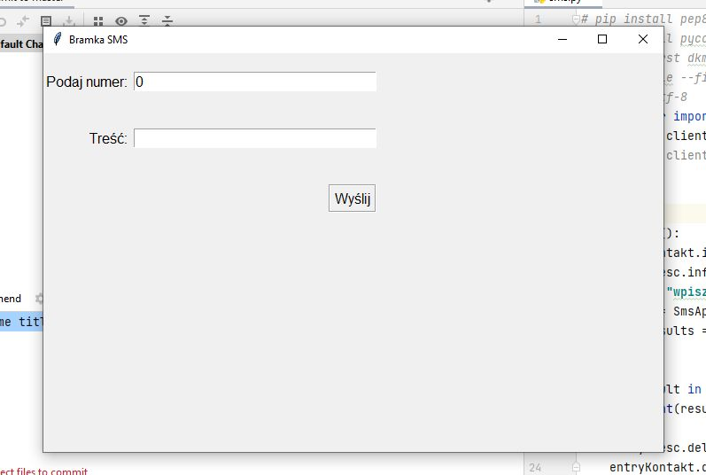

# Dillinger
## _The Last Markdown Editor, Ever_

# SMS API
This application allows you to easily integrate any service with an SMS, MMS and / or VMS gateway. 

## Table of contents
* [General info](#general-info)
* [Screenshots](#screenshots)
* [Technologies](#technologies)
* [Setup](#setup)
* [Features](#features)
* [Status](#status)
* [Inspiration](#inspiration)
* [Contact](#contact)

## General info
Explore a scalable communication solution for businesses. Group SMS, i.e. marketing and SMS notifications work well in enterprises of all sizes.

Regardless of the sector of activity, SMS is a quick and direct channel to reach customers, potential contractors and employees of the company. Use relatively cheap but effective text messages to send marketing messages, important notifications or payment reminders. 

## Screenshots

## Technologies
* Python - version 3.8

## Setup
There are one versions for launch:
* PY file to be run on any operating system after installing the Python interpreter 

## Code Examples
Show examples of usage:
`def sendSMS():
    entryKontakt.info = entryKontakt.get()
    entryTresc.info = entryTresc.get()
    token = "wpisz swoj Token"
    client = SmsApiPlClient(access_token=token)
    send_results = client.sms.send(to=entryKontakt.info,
                                   message=entryTresc.info,
                                   from_="SMBUDOWLANI")`

## Features
List of features ready and TODOs for future development
* Number field empty
 

To-do list:
* Try and Except in searching fields
* Textbox message
* TDD

## Status
Project is: _in progress_, 

## Inspiration
Completely original project.

## Contact
Created by [@ithelparturgolata](ithelparturgolata@gmail.com) - feel free to contact me!
